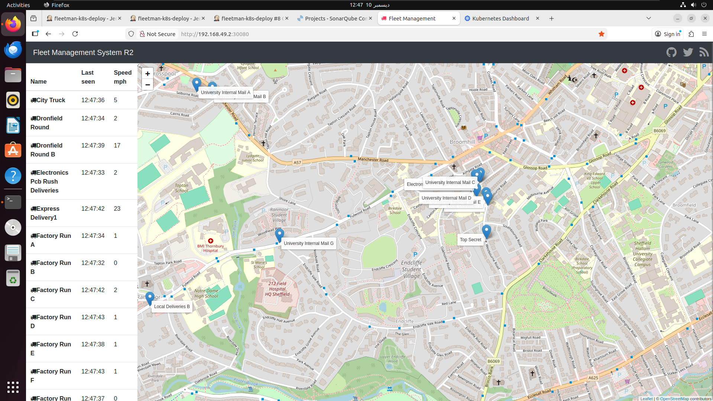
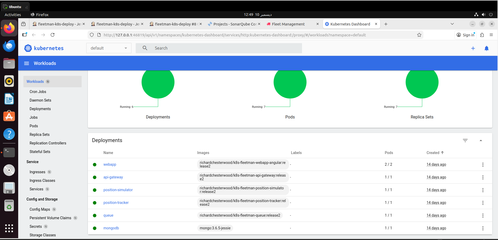
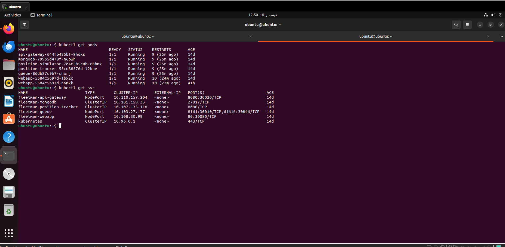
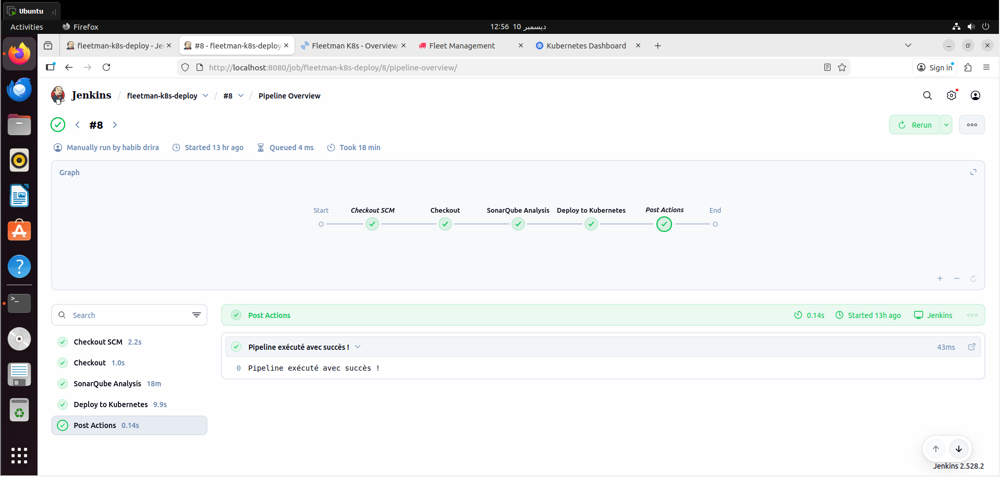
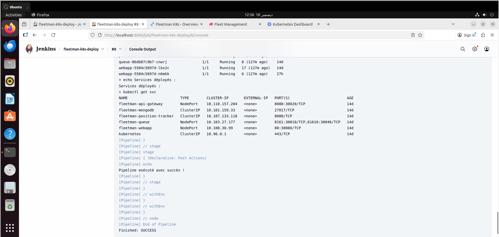
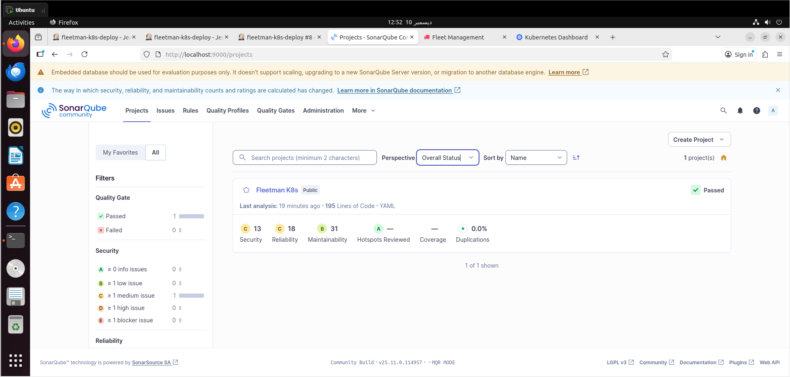

# Fleetman K8s – Microservices & CI/CD

Ce projet déploie l’application **Fleetman** (un système de tracking GPS de véhicules) sur un cluster Kubernetes Minikube.  
L’environnement intègre : **Docker**, **Kubernetes**, **Jenkins CI/CD**, **SonarQube**, et plusieurs microservices communiquant entre eux.

---

## 🖼️ Aperçu général du système

### 🚚 Application Fleetman en fonctionnement


---

## 🏗️ 1. Prérequis & Installation

### 🔹 Installer Docker
```bash
sudo apt update
sudo apt install docker.io -y
sudo systemctl enable --now docker
sudo usermod -aG docker $USER
```

### 🔹 Installer kubectl & Minikube
```bash
sudo apt install curl -y
curl -LO https://storage.googleapis.com/minikube/releases/latest/minikube-linux-amd64
sudo install minikube-linux-amd64 /usr/local/bin/minikube

sudo apt install kubectl -y
minikube start --driver=docker
```

### 🔹 Installer Jenkins
```bash
sudo apt install openjdk-17-jdk -y
java -version
sudo apt install jenkins -y
sudo systemctl enable --now jenkins
```

### 🔹 Installer SonarQube (Docker)
```bash
sudo docker run -d --name sonarqube \
  -e SONAR_ES_BOOTSTRAP_CHECKS_DISABLE=true \
  -p 9000:9000 sonarqube:latest
```

Accès SonarQube : http://localhost:9000 (admin / admin)

---

## 🚀 2. Architecture Kubernetes

Microservices déployés :
- `webapp`
- `api-gateway`
- `position-tracker`
- `position-simulator`
- `queue` (ActiveMQ)
- `mongodb` (avec PVC)

### 📸 Vue Kubernetes Dashboard


---

## 📦 3. Déploiement Kubernetes

Déployer tous les services :

```bash
kubectl apply -f storage
kubectl apply -f database
kubectl apply -f queue
kubectl apply -f api-gateway
kubectl apply -f position-simulator
kubectl apply -f position-tracker
kubectl apply -f webapp
```

Vérification :

```bash
kubectl get pods
kubectl get svc
```

### 📸 Pods et Services


Accès à l’application :
```
http://$(minikube ip):30080
```

---

## 🔧 4. Pipeline CI/CD Jenkins

Le pipeline automatisé effectue :

- Récupération du code GitHub  
- Analyse de qualité SonarQube  
- Déploiement Kubernetes  
- Affichage de l’état des pods & services  

### 📸 Vue Pipeline Jenkins


### 📸 Fin d'exécution du pipeline


---

## 📊 5. Analyse de qualité SonarQube

Le code YAML & configuration K8s sont analysés par SonarQube.

### 📸 Tableau de bord SonarQube


---

## 📂 6. Structure du projet

```
fleetman-k8s/
 ├── api-gateway/
 ├── database/
 ├── position-simulator/
 ├── position-tracker/
 ├── queue/
 ├── storage/
 ├── webapp/
 ├── images/
 └── Jenkinsfile
```

---

## ✅ 7. Résultat final

✔️ Microservices fonctionnels sur Minikube  
✔️ Pipeline CI/CD complet avec Jenkins  
✔️ Analyse de qualité SonarQube passée  
✔️ Application Fleetman accessible via NodePort  
✔️ Projet documenté + images d'exécution  

---

## 🎉 Fin du projet

Ce projet démontre un pipeline DevOps complet :  
**Build → Analyse → Déploiement Kubernetes → Validation**

